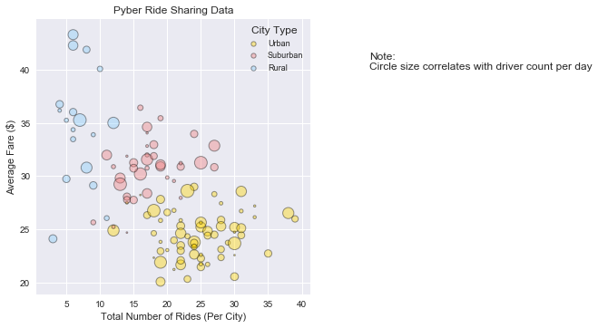
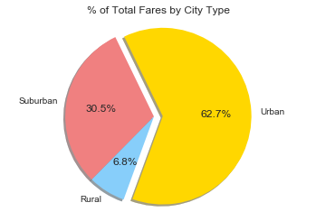
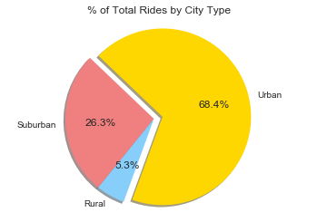
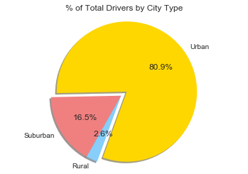

```python
import pandas as pd
import matplotlib.pyplot as plt
import seaborn as sns
```


```python
#Read CSVs
Pyber_ridesdata= pd.read_csv('/Users/rulaothman/Desktop/MatplotlibChallenge/Pyber/raw_data/ride_data.csv')
Pyber_citydata= pd.read_csv('/Users/rulaothman/Desktop/MatplotlibChallenge/Pyber/raw_data/city_data.csv')

#Merge DataFrames
Pyber_data = pd.merge(Pyber_ridesdata, Pyber_citydata)
Pyber_data.head()
```


<div>
<style scoped>
    .dataframe tbody tr th:only-of-type {
        vertical-align: middle;
    }

    .dataframe tbody tr th {
        vertical-align: top;
    }

    .dataframe thead th {
        text-align: right;
    }
</style>
<table border="1" class="dataframe">
  <thead>
    <tr style="text-align: right;">
      <th></th>
      <th>city</th>
      <th>date</th>
      <th>fare</th>
      <th>ride_id</th>
      <th>driver_count</th>
      <th>type</th>
    </tr>
  </thead>
  <tbody>
    <tr>
      <th>0</th>
      <td>Lake Jonathanshire</td>
      <td>2018-01-14 10:14:22</td>
      <td>13.83</td>
      <td>5739410935873</td>
      <td>5</td>
      <td>Urban</td>
    </tr>
    <tr>
      <th>1</th>
      <td>Lake Jonathanshire</td>
      <td>2018-04-07 20:51:11</td>
      <td>31.25</td>
      <td>4441251834598</td>
      <td>5</td>
      <td>Urban</td>
    </tr>
    <tr>
      <th>2</th>
      <td>Lake Jonathanshire</td>
      <td>2018-03-09 23:45:55</td>
      <td>19.89</td>
      <td>2389495660448</td>
      <td>5</td>
      <td>Urban</td>
    </tr>
    <tr>
      <th>3</th>
      <td>Lake Jonathanshire</td>
      <td>2018-04-07 18:09:21</td>
      <td>24.28</td>
      <td>7796805191168</td>
      <td>5</td>
      <td>Urban</td>
    </tr>
    <tr>
      <th>4</th>
      <td>Lake Jonathanshire</td>
      <td>2018-01-02 14:14:50</td>
      <td>13.89</td>
      <td>424254840012</td>
      <td>5</td>
      <td>Urban</td>
    </tr>
  </tbody>
</table>
</div>


```python
#Create Bubble Plots 
average_fare=Pyber_data.groupby('city').mean()
total_ride = Pyber_data.groupby('city').count()
nondup_citydata= Pyber_data.drop_duplicates('city').set_index('city')

bubble_data= {'Average Fare': average_fare['fare'],
             'Total Ride': total_ride['ride_id'],
             'Total Driver': nondup_citydata['driver_count'],
             'City Type': nondup_citydata['type']}
bubble_data = pd.DataFrame(bubble_data).reset_index()

#Pybar Color Scheme 

colors = ['gold', 'lightcoral', 'lightskyblue']

#Plot Bubbles
sns.set()
sns.lmplot(x='Total Ride', y='Average Fare', hue='City Type', data=bubble_data, fit_reg=False, legend_out=False, scatter_kws={"s": bubble_data['Total Driver']*3, 'alpha':0.4, 'linewidth':1, 'edgecolors':"black"}, palette=colors)

plt.legend(fontsize='9', title='City Type', markerscale=0.5) 
plt.title("Pyber Ride Sharing Data")
plt.ylabel("Average Fare ($)")
plt.xlabel("Total Number of Rides (Per City)")
plt.text(50, 40, "Note:\nCircle size correlates with driver count per day", ha='left')

plt.show()
```





```python
#Create Pie Charts 

def create_pie(title = 'Title', **kwargs):
    labels = ["Urban", "Suburban", "Rural"]
    colors = ['gold', 'lightcoral', 'lightskyblue']
    explode = (0.1,0,0)
    sizes = [kwargs['Urban'], kwargs['Suburban'], kwargs ['Rural']]
    
    plt.pie(sizes, explode=explode, labels=labels, colors=colors, autopct="%1.1f%%", shadow=True, startangle=250)
    
    plt.axis("equal")
    plt.title(title)
    
    plt.show()
    
```


```python
#Total Fares 

Urban = Pyber_data[Pyber_data['type']=='Urban'].sum()
Suburban = Pyber_data[Pyber_data['type']=='Suburban'].sum()
Rural = Pyber_data[Pyber_data['type']=='Rural'].sum()
create_pie(title="% of Total Fares by City Type", Urban=Urban['fare'], Suburban=Suburban['fare'], Rural=Rural['fare'])

```





```python
#Total Rides 

Urban = Pyber_data[Pyber_data['type']=='Urban'].count()
Suburban = Pyber_data[Pyber_data['type']=='Suburban'].count()
Rural = Pyber_data[Pyber_data['type']=='Rural'].count()
create_pie(title="% of Total Rides by City Type", Urban=Urban['fare'], Suburban=Suburban['fare'], Rural=Rural['fare'])
```





```python
#Total Drivers 
Urban = Pyber_data[Pyber_data['type']=='Urban'].drop_duplicates('city').set_index('city').sum()
Suburban = Pyber_data[Pyber_data['type']=='Suburban'].drop_duplicates('city').set_index('city').sum()
Rural = Pyber_data[Pyber_data['type']=='Rural'].drop_duplicates('city').set_index('city').sum()

create_pie(title="% of Total Drivers by City Type", Urban=Urban['driver_count'], Suburban=Suburban['driver_count'], Rural=Rural['driver_count'])
```




